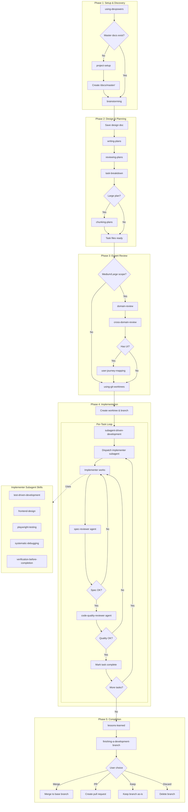

# Devpowers

Devpowers is a complete software development workflow for your coding agents, built on top of a set of composable "skills" and some initial instructions that make sure your agent uses them.

## How it works

It starts from the moment you fire up your coding agent. Before any code is written, devpowers checks for **master documents**—project-wide knowledge like architecture decisions, design systems, API schemas, and domain terminology. If they don't exist, it guides you through creating them.

When you're ready to build something, the agent *doesn't* just jump into writing code. Instead, it steps back and asks you what you're really trying to do.

Once it's teased a spec out of the conversation, it shows it to you in chunks short enough to actually read and digest. Then it writes a **high-level plan** that gets reviewed for feasibility before breaking down into **detailed task files** with exact file paths, complete code, and verification steps.

For UI features, it maps **user journeys** that drive E2E test planning. For complex features, it runs **domain expert reviews** to catch architectural issues early.

After you've signed off on the plan, your agent creates an isolated **git worktree** and launches a *subagent-driven-development* process—dispatching fresh subagents per task with **two-stage review** (spec compliance, then code quality). It's not uncommon for Claude to work autonomously for a couple hours at a time without deviating from the plan.

Throughout implementation, subagents use domain-specific skills like **frontend-design** (avoiding generic AI aesthetics) and **playwright-testing** (deriving tests from journey maps). When things go wrong, **systematic-debugging** ensures root cause analysis instead of guessing.

Before completion, the agent captures **learnings**—what worked, what didn't, and what to remember for next time. Then it presents structured options for finishing: merge locally, create PR, keep the branch, or discard.

And because the skills trigger automatically based on context, you don't need to do anything special. Your coding agent just has Devpowers.

## Workflow Diagram



**Legend:**
- **Rectangles** = Skills (automatic triggering based on context)
- **Diamonds** = Decision points
- **Dotted lines** = Skills available to subagents during implementation

## Sponsorship

If Devpowers has helped you do stuff that makes money and you are so inclined, I'd greatly appreciate it if you'd consider [sponsoring my opensource work](https://github.com/sponsors/obra).

Thanks!

- Jesse


## Installation

**Note:** Installation differs by platform. Claude Code has a built-in plugin system. Codex and OpenCode require manual setup.

### Claude Code (via Plugin Marketplace)

In Claude Code, register the marketplace first:

```bash
/plugin marketplace add arobb/devpowers-marketplace
```

Then install the plugin from this marketplace:

```bash
/plugin install devpowers@devpowers-marketplace
```

### Verify Installation

Check that skills load:

```bash
/help
```

```
# Should see devpowers skills listed, including:
# - devpowers:brainstorming
# - devpowers:writing-plans
# - devpowers:subagent-driven-development
# - devpowers:test-driven-development
# and more...
```

### Codex

Tell Codex:

```
Fetch and follow instructions from https://raw.githubusercontent.com/arobb/devpowers/refs/heads/main/.codex/INSTALL.md
```

**Detailed docs:** [docs/README.codex.md](docs/README.codex.md)

### OpenCode

Tell OpenCode:

```
Fetch and follow instructions from https://raw.githubusercontent.com/arobb/devpowers/refs/heads/main/.opencode/INSTALL.md
```

**Detailed docs:** [docs/README.opencode.md](docs/README.opencode.md)

## The Basic Workflow

The workflow adapts to feature scope (trivial → small → medium → large):

### Phase 1: Setup & Discovery

1. **using-devpowers** - Entry point. Detects workflow state, checks for master documents, assesses scope, routes to appropriate skill.

2. **project-setup** - Activates if `/docs/master/` missing. Creates master documents: architecture, design system, API schemas, domain terminology.

### Phase 2: Design & Planning

3. **brainstorming** - Refines rough ideas through questions, explores 2-3 approaches, presents design in sections for validation. Saves design document.

4. **writing-plans** - Creates high-level implementation plan with phases and dependencies. Emphasizes TDD, YAGNI, DRY.

5. **reviewing-plans** - Reviews plan for feasibility, identifies risks, validates against master documents.

6. **task-breakdown** - Breaks high-level plan into detailed task files (2-5 minutes each) with exact file paths, complete code, test plans.

7. **chunking-plans** - Splits large plans into navigable task file folders when needed.

### Phase 3: Expert Review (Medium/Large features)

8. **domain-review** - Single-domain expert review (security, performance, UX, etc.) for specialized validation.

9. **cross-domain-review** - Multi-domain validation ensuring coherent integration across concerns.

10. **user-journey-mapping** - For UI features: maps user journeys that drive E2E test planning.

### Phase 4: Implementation

11. **using-git-worktrees** - Creates isolated workspace on new branch, runs project setup, verifies clean test baseline.

12. **subagent-driven-development** - Dispatches fresh subagent per task with two-stage review (spec compliance, then code quality).

13. **test-driven-development** - Enforces RED-GREEN-REFACTOR: write failing test, watch it fail, write minimal code, watch it pass, commit.

### Phase 5: Completion

14. **lessons-learned** - Captures insights, gotchas, and patterns discovered during implementation.

15. **finishing-a-development-branch** - Verifies tests, presents options (merge/PR/keep/discard), cleans up worktree.

**The agent checks for relevant skills before any task.** Mandatory workflows, not suggestions.

## What's Inside

### Skills Library

**Setup & Discovery**
- **using-devpowers** - Entry point, scope detection, workflow state management
- **project-setup** - Master document creation (architecture, design system, API schemas, terminology)

**Design & Planning**
- **brainstorming** - Socratic design refinement, explores alternatives
- **writing-plans** - High-level implementation plans with TDD emphasis
- **reviewing-plans** - Plan feasibility review against master documents
- **task-breakdown** - Detailed task files with exact paths and code
- **chunking-plans** - Splits large plans into navigable folders

**Expert Review**
- **domain-review** - Single-domain expert review (security, performance, UX, etc.)
- **cross-domain-review** - Multi-domain integration validation
- **user-journey-mapping** - E2E test scenarios from user flows

**Implementation**
- **using-git-worktrees** - Isolated workspace creation
- **subagent-driven-development** - Fresh subagent per task with two-stage review
- **dispatching-parallel-agents** - Concurrent subagent workflows

**Testing**
- **test-driven-development** - RED-GREEN-REFACTOR cycle with test plan integration
- **playwright-testing** - E2E tests derived from user journeys

**Domain-Specific**
- **frontend-design** - UI components avoiding generic AI aesthetics, uses project design system

**Debugging**
- **systematic-debugging** - 4-phase root cause process (root-cause-tracing, defense-in-depth, condition-based-waiting)
- **verification-before-completion** - Evidence before claims

**Code Quality**
- **requesting-code-review** - Pre-review checklist
- **receiving-code-review** - Responding to feedback

**Completion**
- **lessons-learned** - Capture insights and gotchas
- **finishing-a-development-branch** - Merge/PR decision, worktree cleanup

**Meta**
- **writing-skills** - Create new skills following best practices (includes testing methodology)

### Hook Automation

Devpowers includes workflow automation hooks that run automatically:

- **SessionStart** - Loads workflow state and context
- **UserPromptSubmit** - Suggests relevant skills based on your message
- **PreToolUse (Write)** - Validates file writes against master documents
- **PreToolUse (Bash)** - Prevents heredoc file creation (use Write tool instead)
- **PostToolUse (Write)** - Detects task file creation for task-breakdown
- **SubagentStop** - Reviews subagent work before completion
- **Stop** - Prompts for learnings capture before ending
- **Notification** - Desktop toast notifications when Claude needs input

### Master Documents

Devpowers creates project-wide knowledge in `/docs/master/`:

- **architecture.md** - System design, component boundaries, data flow
- **design-system.md** - UI patterns, colors, typography, component library
- **api-schemas.md** - Endpoint contracts, request/response formats
- **terminology.md** - Domain-specific language and definitions

These documents are referenced throughout the workflow to ensure consistency.

## Philosophy

- **Test-Driven Development** - Write tests first, always
- **Systematic over ad-hoc** - Process over guessing
- **Two-level planning** - High-level design → detailed task breakdown
- **Expert review early** - Catch architectural issues before implementation
- **Fresh context per task** - Subagents prevent context pollution
- **Evidence over claims** - Verify before declaring success
- **Capture learnings** - Document what worked and what didn't
- **YAGNI ruthlessly** - Remove unnecessary features from all designs

Read more: [Devpowers for Claude Code](https://blog.fsck.com/2025/10/09/superpowers/)

## Contributing

Skills live directly in this repository. To contribute:

1. Fork the repository
2. Create a branch for your skill
3. Follow the `writing-skills` skill for creating and testing new skills
4. Submit a PR

See `skills/writing-skills/SKILL.md` for the complete guide.

## Updating

Skills update automatically when you update the plugin:

```bash
/plugin update devpowers
```

## License

MIT License - see LICENSE file for details

## Support

- **Issues**: https://github.com/arobb/devpowers/issues
- **Marketplace**: https://github.com/arobb/devpowers-marketplace
