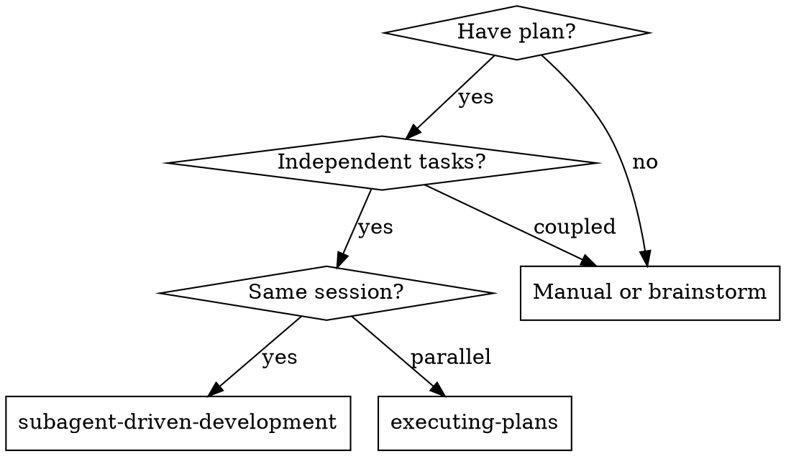
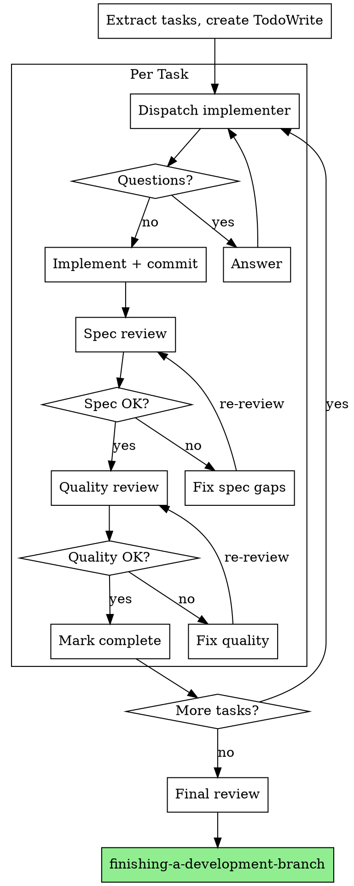

# Subagent-Driven Development

Fresh subagent per task + two-stage review (spec then quality) = high quality, fast iteration.

## When to Use

## The Process

## Prompt Templates

- `references/implementer-prompt.md` - Implementer subagent
- `references/spec-reviewer-prompt.md` - Spec compliance reviewer
- `references/code-quality-reviewer-prompt.md` - Code quality reviewer

## Task Execution

1. Read task from `/docs/plans/[feature]/tasks/`
2. Check "Unit Test Plan" and "E2E Test Plan" sections
3. Follow TDD: tests first, then implement

## Red Flags

**Never:**
- Skip reviews (spec OR quality)
- Proceed with unfixed issues
- Dispatch parallel implementers (conflicts)
- Make subagent read plan (provide full text)
- Skip scene-setting context
- Ignore subagent questions
- Accept "close enough" on spec
- Skip review loops
- Let self-review replace actual review
- **Quality review before spec passes**
- Move on with open issues

**Questions:** Answer clearly. Don't rush.

**Issues found:** Implementer fixes, re-review, repeat until approved.

**Failed task:** Dispatch fix subagent. Don't fix manually.

## References

- `references/example-workflow.md` - Complete example
- `references/integration.md` - Related skills
- `references/learnings-template.md` - Capture learnings
