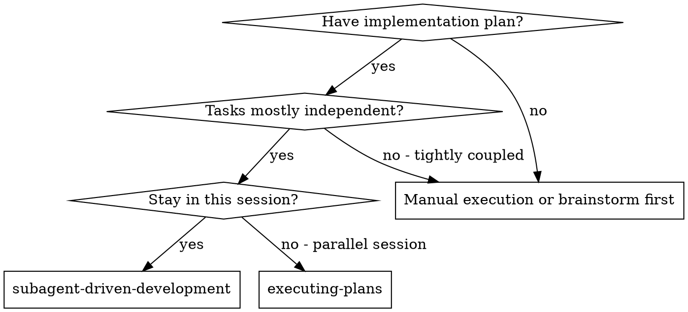
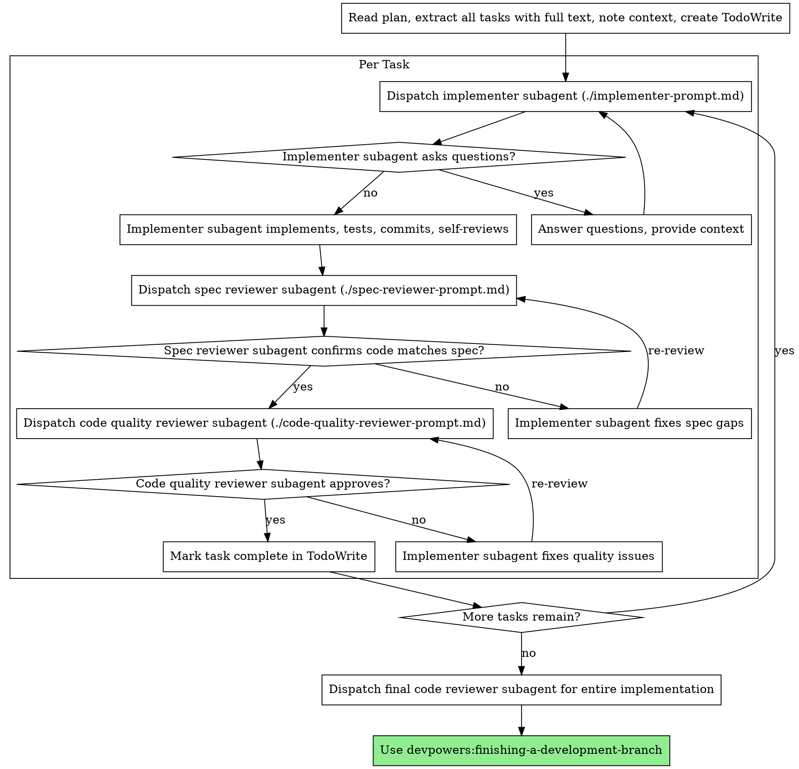

# Subagent-Driven Development

Execute plan by dispatching fresh subagent per task, with two-stage review after each: spec compliance review first, then code quality review.

**Core principle:** Fresh subagent per task + two-stage review (spec then quality) = high quality, fast iteration

## When to Use



**vs. Executing Plans (parallel session):**
- Same session (no context switch)
- Fresh subagent per task (no context pollution)
- Two-stage review after each task: spec compliance first, then code quality
- Faster iteration (no human-in-loop between tasks)

## The Process



## Prompt Templates

- `./implementer-prompt.md` - Dispatch implementer subagent
- `./spec-reviewer-prompt.md` - Dispatch spec compliance reviewer subagent
- `./code-quality-reviewer-prompt.md` - Dispatch code quality reviewer subagent

## Task Execution

Before implementing each task:
1. Read task document from `/docs/plans/[feature]/tasks/`
2. Check "Unit Test Plan" section for pre-planned tests
3. Check "E2E Test Plan" section for integration tests
4. Follow TDD: Write tests first, then implement

## TDD Flow

For each task:
1. Read "Unit Test Plan" from task document
2. Write the first failing test from the plan
3. Run test, confirm it fails
4. Write minimal implementation to pass
5. Run test, confirm it passes
6. Repeat for remaining tests in plan
7. Check "E2E Test Plan" and ensure coverage

## Example Workflow

```
You: I'm using Subagent-Driven Development to execute this plan.

[Read plan file once: docs/plans/feature-plan.md]
[Extract all 5 tasks with full text and context]
[Create TodoWrite with all tasks]

Task 1: Hook installation script

[Get Task 1 text and context (already extracted)]
[Dispatch implementation subagent with full task text + context]

Implementer: "Before I begin - should the hook be installed at user or system level?"

You: "User level (~/.config/devpowers/hooks/)"

Implementer: "Got it. Implementing now..."
[Later] Implementer:
  - Implemented install-hook command
  - Added tests, 5/5 passing
  - Self-review: Found I missed --force flag, added it
  - Committed

[Dispatch spec compliance reviewer]
Spec reviewer: ✅ Spec compliant - all requirements met, nothing extra

[Get git SHAs, dispatch code quality reviewer]
Code reviewer: Strengths: Good test coverage, clean. Issues: None. Approved.

[Mark Task 1 complete]

Task 2: Recovery modes

[Get Task 2 text and context (already extracted)]
[Dispatch implementation subagent with full task text + context]

Implementer: [No questions, proceeds]
Implementer:
  - Added verify/repair modes
  - 8/8 tests passing
  - Self-review: All good
  - Committed

[Dispatch spec compliance reviewer]
Spec reviewer: ❌ Issues:
  - Missing: Progress reporting (spec says "report every 100 items")
  - Extra: Added --json flag (not requested)

[Implementer fixes issues]
Implementer: Removed --json flag, added progress reporting

[Spec reviewer reviews again]
Spec reviewer: ✅ Spec compliant now

[Dispatch code quality reviewer]
Code reviewer: Strengths: Solid. Issues (Important): Magic number (100)

[Implementer fixes]
Implementer: Extracted PROGRESS_INTERVAL constant

[Code reviewer reviews again]
Code reviewer: ✅ Approved

[Mark Task 2 complete]

...

[After all tasks]
[Dispatch final code-reviewer]
Final reviewer: All requirements met, ready to merge

Done!
```

## Learnings Capture

During implementation, when you encounter:
- Multiple iterations needed to solve something
- Documentation that didn't match reality
- A pattern that emerged across multiple places
- A workaround that was required
- Something that "should have worked" but didn't

Append to `/docs/plans/[feature]/learnings.md`:

```markdown
### [Date/Task] - Brief title
**Context:** What was being attempted
**Issue:** What went wrong or was tricky
**Resolution:** What finally worked
**Lesson:** What to remember for next time
```

## After Each Task

After implementing a task:
1. Run tests to verify implementation
2. Invoke code-reviewer agent for review
3. Address any findings from review
4. Commit with descriptive message
5. Update STATUS.md task status to complete

## Advantages

**vs. Manual execution:**
- Subagents follow TDD naturally
- Fresh context per task (no confusion)
- Parallel-safe (subagents don't interfere)
- Subagent can ask questions (before AND during work)

**vs. Executing Plans:**
- Same session (no handoff)
- Continuous progress (no waiting)
- Review checkpoints automatic

**Efficiency gains:**
- No file reading overhead (controller provides full text)
- Controller curates exactly what context is needed
- Subagent gets complete information upfront
- Questions surfaced before work begins (not after)

**Quality gates:**
- Self-review catches issues before handoff
- Two-stage review: spec compliance, then code quality
- Review loops ensure fixes actually work
- Spec compliance prevents over/under-building
- Code quality ensures implementation is well-built

**Cost:**
- More subagent invocations (implementer + 2 reviewers per task)
- Controller does more prep work (extracting all tasks upfront)
- Review loops add iterations
- But catches issues early (cheaper than debugging later)

## Red Flags

**Never:**
- Skip reviews (spec compliance OR code quality)
- Proceed with unfixed issues
- Dispatch multiple implementation subagents in parallel (conflicts)
- Make subagent read plan file (provide full text instead)
- Skip scene-setting context (subagent needs to understand where task fits)
- Ignore subagent questions (answer before letting them proceed)
- Accept "close enough" on spec compliance (spec reviewer found issues = not done)
- Skip review loops (reviewer found issues = implementer fixes = review again)
- Let implementer self-review replace actual review (both are needed)
- **Start code quality review before spec compliance is ✅** (wrong order)
- Move to next task while either review has open issues

**If subagent asks questions:**
- Answer clearly and completely
- Provide additional context if needed
- Don't rush them into implementation

**If reviewer finds issues:**
- Implementer (same subagent) fixes them
- Reviewer reviews again
- Repeat until approved
- Don't skip the re-review

**If subagent fails task:**
- Dispatch fix subagent with specific instructions
- Don't try to fix manually (context pollution)

## Integration

**Required workflow skills:**
- **devpowers:writing-plans** - Creates the plan this skill executes
- **devpowers:requesting-code-review** - Code review template for reviewer subagents
- **devpowers:finishing-a-development-branch** - Complete development after all tasks

**Subagents should use:**
- **devpowers:test-driven-development** - Subagents follow TDD for each task

**Domain-specific skills for implementer subagents:**
- **devpowers:frontend-design** - For UI component tasks (avoids generic AI aesthetics, uses project design system)
- **devpowers:playwright-testing** - For E2E test tasks (derives tests from user journey maps)

When dispatching implementer subagents, include in context:
- For UI tasks: "Use devpowers:frontend-design skill. Read /docs/master/design-system.md first."
- For E2E test tasks: "Use devpowers:playwright-testing skill. Derive tests from /docs/plans/[feature]/journeys/."

**Problem-solving skills for implementer subagents:**
- **devpowers:systematic-debugging** - When encountering bugs or unexpected behavior
- **devpowers:verification-before-completion** - Before claiming any task is complete

**Parallel execution:**
- **devpowers:dispatching-parallel-agents** - When multiple independent tasks can run concurrently

**Alternative workflow:**
- **devpowers:executing-plans** - Use for parallel session instead of same-session execution
