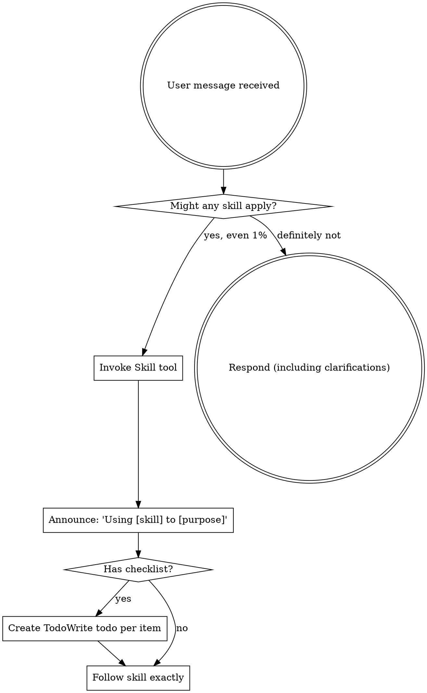

# Using Devpowers

<EXTREMELY-IMPORTANT>
If you think there is even a 1% chance another devpowers skill applies to what you are doing, you ABSOLUTELY MUST invoke that skill.

IF A SKILL APPLIES TO YOUR TASK, YOU DO NOT HAVE A CHOICE. YOU MUST USE IT.

This is not negotiable. This is not optional. You cannot rationalize your way out of this.
</EXTREMELY-IMPORTANT>

## Entry-Point Workflow

```
1. Check /docs/master/ exists
   - If not: hand off to project-setup
   - If yes: continue

2. Check /docs/plans/ for existing features
   - If active feature found: offer to resume or start new
   - If no features: start fresh

3. Assess scope of request (ask user if unclear):
   - Trivial: Direct implementation, no planning
   - Small: brainstorming → plan → implement
   - Medium/Large: Full workflow with reviews

4. Hand off to appropriate skill:
   - project-setup (if /docs/master/ missing)
   - brainstorming (for new features)
   - Resume point (for existing features)
```

## Scope Tiers

| Scope | Description | Workflow |
|-------|-------------|----------|
| **Trivial** | Typo fix, config tweak, single-line change | Direct implementation, no planning |
| **Small** | Bug fix, minor enhancement, <50 lines | Brainstorm → Plan → Implement → Lessons (optional) |
| **Medium** | Feature addition, moderate complexity | Full workflow, skip user journey mapping if no UI |
| **Large** | Major feature, architectural change | Full workflow |

## Detecting Workflow State

Check for existing artifacts:
- `/docs/master/` exists → project setup complete
- `/docs/plans/[feature]/` exists → brainstorming done
- `high-level-plan.md` exists → planning done
- `/tasks/` folder exists → breakdown done
- `STATUS.md` → read for current stage

If resuming, prompt: "Found existing [artifacts] for [feature]. Continue from [stage]?"

## Reading STATUS.md

When STATUS.md exists, extract:
- **Stage** — Current workflow stage
- **Scope** — Trivial/Small/Medium/Large
- **Next Action** — What to do next

## Handoffs

After routing:
- If project-setup needed: "No master docs found. Let's set up the project first." → Invoke `project-setup`
- If new feature: "Ready to brainstorm [feature]?" → Invoke `brainstorming`
- If resume: "Resuming [feature] at [stage]. [Next action]?" → Invoke appropriate skill

## How to Access Skills

**In Claude Code:** Use the `Skill` tool. When you invoke a skill, its content is loaded and presented to you—follow it directly. Never use the Read tool on skill files.

**In other environments:** Check your platform's documentation for how skills are loaded.

## The Rule

**Invoke relevant or requested skills BEFORE any response or action.** Even a 1% chance a skill might apply means that you should invoke the skill to check. If an invoked skill turns out to be wrong for the situation, you don't need to use it.



## Red Flags

These thoughts mean STOP—you're rationalizing:

| Thought | Reality |
|---------|---------|
| "This is just a simple question" | Questions are tasks. Check for skills. |
| "I need more context first" | Skill check comes BEFORE clarifying questions. |
| "Let me explore the codebase first" | Skills tell you HOW to explore. Check first. |
| "I can check git/files quickly" | Files lack conversation context. Check for skills. |
| "Let me gather information first" | Skills tell you HOW to gather information. |
| "This doesn't need a formal skill" | If a skill exists, use it. |
| "I remember this skill" | Skills evolve. Read current version. |
| "This doesn't count as a task" | Action = task. Check for skills. |
| "The skill is overkill" | Simple things become complex. Use it. |
| "I'll just do this one thing first" | Check BEFORE doing anything. |
| "This feels productive" | Undisciplined action wastes time. Skills prevent this. |
| "I know what that means" | Knowing the concept ≠ using the skill. Invoke it. |

## Skill Priority

When multiple skills could apply, use this order:

1. **Process skills first** (brainstorming, debugging) - these determine HOW to approach the task
2. **Implementation skills second** (frontend-design, mcp-builder) - these guide execution

"Let's build X" → brainstorming first, then implementation skills.
"Fix this bug" → debugging first, then domain-specific skills.

## Skill Types

**Rigid** (TDD, debugging): Follow exactly. Don't adapt away discipline.

**Flexible** (patterns): Adapt principles to context.

The skill itself tells you which.

## User Instructions

Instructions say WHAT, not HOW. "Add X" or "Fix Y" doesn't mean skip workflows.
